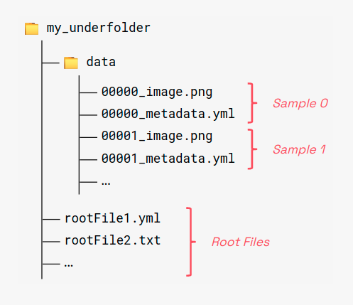
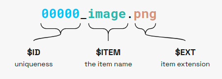

# 🍋 Pipelime

*If life gives you lemons, use Pipelime.*

Data workflows, command line utilities, advanced project configuration, dataflow automation.

---

## Installation

> **WARNING**
>
> You need `Graphviz` <https://www.graphviz.org/> installed on your system.
> On Linux Ubuntu/Debian, you can install it with:
>
> ```
> sudo apt-get install graphviz graphviz-dev
> ```
>
> Alternatively you can use `conda`
>
> ```
> conda install --channel conda-forge pygraphviz
> ```
>
> Please see the full options at https://github.com/pygraphviz/pygraphviz/blob/main/INSTALL.txt

Install Pipelime using pip:

```
pip install pipelime-python
```

## Basic Usage

### Underfolder Format

The **Underfolder** format is the preferred pipelime dataset formats, i.e., a flexible way to
model and store a generic dataset through **filesystem**.



An Underfolder **dataset** is a collection of samples. A **sample** is a collection of items.
An **item** is a unitary block of data, it can be a generic tensor (e.g., a multi-channel image
or a plain matrix), a dictionary and more.
Any valid underfolder dataset must contain a subfolder named `data` with samples
and items. Also, *global shared* items can be stored in the root folder.

Items are named using the following naming convention:



Where:

* `$ID` is the sample index, must be a unique integer for each sample.
* `ITEM` is the item name.
* `EXT` is the item extension.

We currently support many common file formats and others can be added by users:

  * `.png`, `.jpeg/.jpg/.jfif/.jpe`, `.bmp` for images
  * `.tiff/.tif` for multi-page images and multi-dimensional numpy arrays
  * `.yaml/.yml`, `.json` and `.toml/.tml` for metadata
  * `.txt` for numpy 2D matrix notation
  * `.npy` for general numpy arrays
  * `.pkl/.pickle` for pickable python objects
  * `.bin` for generic binary data

Root files follow the same convention but they lack the sample identifier part, i.e., `$ITEM.$EXT`

### Reading an Underfolder Dataset

Pipelime provides an intuitive interface to read, manipulate and write Underfolder Datasets.
No complex signatures, weird object iterators, or boilerplate code, you just need a `SamplesSequence`:

```{python}
    from pipelime.sequences import SamplesSequence

    # Read an underfolder dataset with a single line of code
    dataset = SamplesSequence.from_underfolder('tests/sample_data/datasets/underfolder_minimnist')

    # A dataset behaves like a Sequence
    print(len(dataset))             # the number of samples
    sample = dataset[4]             # get the fifth sample

    # A sample is a mapping
    print(len(sample))              # the number of items
    print(set(sample.keys()))       # the items' keys

    # An item is an object wrapping the actual data
    image_item = sample["image"]    # get the "image" item from the sample
    print(type(image_item))         # <class 'pipelime.items.image_item.PngImageItem'>
    image = image_item()            # actually loads the data from disk (may have been on the cloud as well)
    print(type(image))              # <class 'numpy.ndarray'>
```

### Writing an Underfolder Dataset

You can **write** a dataset by calling the associated operation:

```{python}
    # Attach a "write" operation to the dataset
    dataset = dataset.to_underfolder('/tmp/my_output_dataset')

    # Now run over all the samples
    dataset.run()

    # You can easily spawn multiple processes if needed
    dataset.run(num_workers=4)
```
