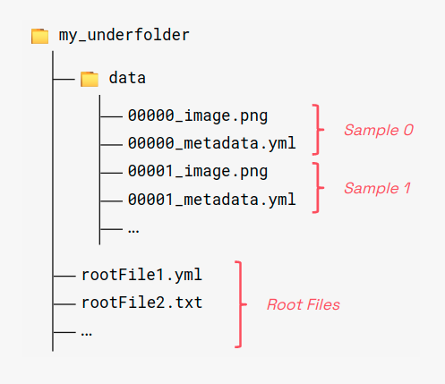

===========
🍋 Pipelime
===========

Data workflows, command line utilities, advanced project configuration, dataflow automation.
Slice your lime with this italian army knife.

Installation
============

.. warning::
   You need `Graphviz <https://www.graphviz.org/>`_ installed on your system.
   On Linux ``Ubuntu/Debian``, you can install it with::

       sudo apt-get install graphviz graphviz-dev

   Alternatively you can use ``conda``::

        conda install --channel conda-forge pygraphviz

   Please see the full options at https://github.com/pygraphviz/pygraphviz/blob/main/INSTALL.txt

.. code-block:: bash

        pip install pipelime-python

Basic Usage
===========

Underfolder Format
------------------

The **Underfolder** format is one of the pipelime dataset formats, i.e., a flexible way to
model and store a generic dataset through **filesystem**.

An Underfolder **dataset** is a collection of samples. A **sample** is a collection of items.
An **item** is a unitary block of data, it can be a generic tensor (e.g. a multi-channel image
or a plain matrix), a dictionary and more.

Underfolder datasets must contain a subfolder named ``data`` that will actually contain the
samples and items. Optionally you can store the items in the root folder directly, they
will act as “global” items injected into each sample.

.. image:: docs/images/naming.png
  :width: 400
  :align: center
  :alt: naming convention

Items are named using the following naming convention:

.. code-block:: bash

        $ID_$ITEM.$EXT

Where:

* ``$ID`` is the sample identifier, must be a unique string for each sample.
* ``ITEM`` is the item name.
* ``EXT`` is the item extension. Currently supported extensions are:

  * The most common image formats: PNG, JPEG, BMP, TIFF (multi-page);
  * YAML, JSON and TOML for dictionary-like objects;
  * TXT for numpy 2D matrix notation;
  * NPY for numpy arrays;
  * PKL for generic pickable python objects;
  * BIN for generic binary data.

Root files follow the same convention but they lack the sample identifier part:

.. code-block:: bash

        $ITEM.$EXT

Reading an Underfolder Dataset
------------------------------

Pipelime provides an intuitive interface to read, manipulate and write Underfolder Datasets.
You don't have to memorize complex signatures, instantiate weird object iterators, or write
tens of lines of boilerplate code. It all boils down to a **reader**, a **writer** and objects that
behave like built-in python types such as **lists** and **dictionaries**.

.. code-block:: python

        from pipelime.sequences.readers.filesystem import UnderfolderReader

        # Read an underfolder dataset with a single line of code
        dataset = UnderfolderReader('tests/sample_data/datasets/underfolder_minimnist')

        # A dataset behaves like a Sequence
        len(dataset) # The number of samples (20)
        sample = dataset[4] # Get a Sample from the dataset

        # A Sample is a MutableMapping
        len(sample) # The number of items (10)
        set(sample.keys()) # The set of all the item names {'cfg', 'image', 'image_mask', ...}
        item = sample['image'] # Get an item from the sample

        # An item can be any python object, depending on which extension is used to store it.
        type(item) # numpy.ndarray
        item.shape # (28, 28, 3)

Writing an Underfolder Dataset
------------------------------

You can **write** a dataset by simply creating and running a writer object.

.. code-block:: python

        from pipelime.sequences.writers.filesystem import UnderfolderWriter

        # Create the writer object from a destination path
        writer = UnderfolderWriter('/tmp/my_output_dataset')
        # Write the dataset to file system
        writer(dataset)

By default, ``UnderfolderWriter`` saves every sample with the extension it was originally read with.
If for any reason it is unable to retrieve the original extension, it will use **pickle** to
serialize the object.

If you don't want to use pickle, you can choose a **custom extension** for each item name.
You can also choose which items are going to be saved as **root files** (if the contained data
is the same for all samples).

.. code-block:: python

        from pipelime.sequences.writers.filesystem import UnderfolderWriter

        # These items are going to be saved as root files
        root_files = ['cfg', 'numbers', 'pose']

        # Associate a custom extension to each item name
        extensions = {
                'image': 'jpg',
                'image_mask': 'png',
                'image_maskinv': 'png',
                'label': 'txt',
                'metadata': 'json',
                'metadatay': 'yml',
                'points': 'txt',
                'numbers': 'txt',
                'pose': 'txt',
                'cfg': 'yml'
        }

        # Create a customized writer object
        writer = UnderfolderWriter(
                '/tmp/my_output_dataset',
                root_files_keys=root_files,
                extensions_map=extensions,
        )
        # Write the dataset to file system
        writer(dataset)
