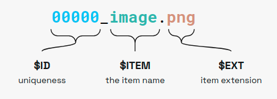

# Underfolder

By default, pipelime reads and writes data in the *Underfolder* format, a flexible file-system based dataset storage format.
The main benefits of using the underfolder format are:

- Flexibility: one single format for pretty much all the datasets that you will ever use.
- Readability: no need to use special viewers to access the dataset, all data is stored as separate files with common extensions, making it easy to manually inspect.
- Low disk usage: pipelime takes advantage of hard-links and item sharing to minimize disk usage.

An Underfolder **dataset** is a collection of samples. A **sample** is a collection of items.
An **item** is a unitary block of data, i.e., a multi-channel image, a python object,
a dictionary and more.
The file system structure is here summarized:

Any valid underfolder dataset must contain a subfolder named `data` with samples
and items. Also, *global shared* items can be stored in the root folder.
All items are stored as separate files, with a specific naming rule:

Where:

* `$ID` is the sample index, must be a unique integer for each sample.
* `ITEM` is the item name.
* `EXT` is the item extension.

We currently support many common file formats and others can be added by users:

  * `.png`, `.jpeg/.jpg/.jfif/.jpe`, `.bmp` for images
  * `.tiff/.tif` for multi-page images and multi-dimensional numpy arrays
  * `.yaml/.yml`, `.json` and `.toml/.tml` for metadata
  * `.txt` for numpy 2D matrix notation
  * `.npy` for general numpy arrays
  * `.obj`, `.ply`, `.off`, `.stl` and `.glb` for 3D models
  * `.pkl/.pickle` for picklable python objects
  * `.bin` for generic binary data

Root files follow the same convention but they lack the sample identifier part, i.e., `$ITEM.$EXT`
