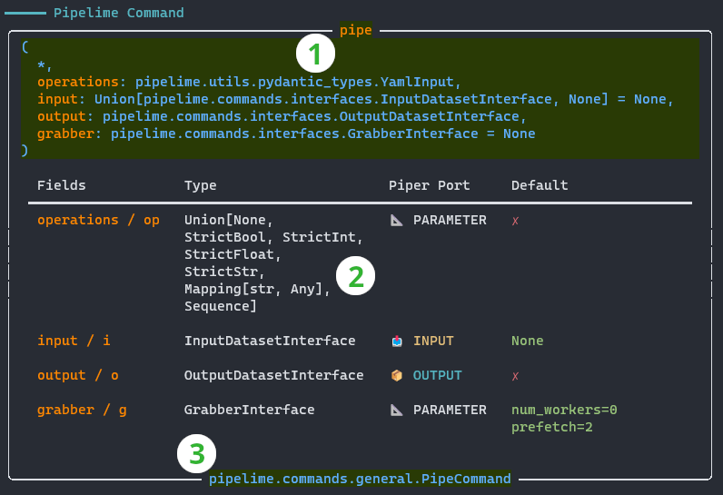

| [<mark>Introduction</mark>](./toc.md) | [<mark>**Convert Data To Underfolder**</mark>](./convert_to_underfolder.md) | [<mark>Dataset Splitting</mark>](./dataset_splitting.md) | [<mark>Creating New Items</mark>](./item_creation.md) |
| :------: | :------: | :------: | :------: |

# Convert Data To Underfolder

The [Underfolder](../get_started/underfolder.md) format is a general data representation
introduced by Pipelime, so you will often need to convert data coming from other sources
to the Underfolder format.
In this tutorial, you will write a samples sequence generator to convert the `iris` dataset
and you will learn how to call it from command line.

```{warning}
The purpose of the code you will see in this tutorial is purely didactic.
Sometimes the implementation is sub-optimal and it is not intended to be used in any real-world scenario.
```

## The Iris Dataset

The [iris dataset](https://en.wikipedia.org/wiki/Iris_flower_data_set) is a classic dataset
comprising 3 species of Iris of 50 instances each. For each instance, 4 features are provided:
sepal length, sepal width, petal length, petal width.

The scikit-learn package provides a function to load the iris dataset as a dictionary:

```python
from sklearn.datasets import load_iris

dataset = load_iris()
```

The output mapping contains the following keys:
* `data`: a numpy array of shape `(n_samples, n_features)` containing the features
* `target`: a numpy array of shape `(n_samples,)` containing the labels
* `feature_names`: a list of strings containing the feature names
* `target_names`: a list of strings containing the label names, ie, _setosa_, _versicolor_, _virginica_

Mapping such keys to the Underfolder format is straightforward:
* `data`: each row of the array is a sample
* `target`: each value is the label ID of a sample
* `feature_names`: the name of the features will be the names of the sample items
* `target_names`: the name of the target labels can be saved once for all samples,
so we will put them into a shared item

## A Samples Sequence Generator

To write a samples sequence generator for the Iris dataset, we need to:
1. subclass `SamplesSequence` with the `source_sequence` decorator
1. give it a _title_ which will be the name of the method to call (see below)
1. implement the methods `def size(self) -> int` and `def get_sample(self, idx: int) -> pls.Sample`

Note that `SamplesSequence` is a pydantic model, so we must follow the [pydantic rules](https://docs.pydantic.dev/) when defining a class:

```python
from typing import Mapping
from pydantic import Field, PrivateAttr

import numpy as np
from sklearn.datasets import load_iris

from pipelime.sequences import SamplesSequence, Sample, source_sequence
import pipelime.items as pli

@source_sequence
class IridDataset(SamplesSequence, title="iris"):
    """Samples sequence generator for the Iris dataset."""

    shared_items: bool = Field(
        True, description="Whether to include the shared items in each sample."
    )

    _shared_sample: Sample = PrivateAttr()
    _data_mtx: np.ndarray = PrivateAttr()
    _target_mtx: np.ndarray = PrivateAttr()
    _feature_names: Sequence[str] = PrivateAttr()

    def __init__(self, **data):
        super().__init__(**data)
        dataset = load_iris()
        self._shared_sample = self._make_shared_sample(dataset)
        self._data_mtx = dataset["data"]
        self._target_mtx = dataset["target"]
        self._feature_names = [
            fname[:-4].title().replace(" ", "")
            for fname in dataset["feature_names"]
        ]

    def _make_shared_sample(self, dataset) -> Sample:
        # A sample with shared items is created only once
        return Sample(  # a mapping of item keys to items
            {
                "targets": pli.YamlMetadataItem(  # a YAML metadata item
                    dataset["target_names"].tolist(),  # the content of the YAML
                    shared=True,  # the item is shared
                )
            }
        )

    def size(self) -> int:
        return self._data_mtx.shape[0]

    def get_sample(self, idx: int) -> Sample:
        sample = Sample(  # a mapping of item keys to items
            {
                # one numpy item for each feature and the target label
                **{
                    fname: pli.TxtNumpyItem(self._data_mtx[idx, i])
                    for i, fname in enumerate(self._feature_names)
                },
                "target": pli.TxtNumpyItem(self._target_mtx[idx]),
            }
        )
        if self.shared_items:
            # the shared sample is merged with the current sample
            sample = self._shared_sample.merge(sample)
        return sample
```

```{note}
The code `fname[:-4].title().replace(" ", "")` removes the final `(cm)` text, capitalizes the first letter of each word and strips any space.
Though not strictly necessary, the ["Creating New Items"](./item_creation.md) step needs this simple processing.
```

```{hint}
Pydantic is a powerful framework to enrich your classes with data parsing, validation and smart type checking.
If you are not familiar with it, take a look at the [official documentation](https://docs.pydantic.dev/).
```

## Iris To Underfolder (Python)

When the module is imported, the `iris` method is automatically added to the `SamplesSequence` class, so you can call it as follows:

```python
from pipelime.sequences import SamplesSequence
from pipelime.cli import pl_print

# create a samples sequence generator
iris_seq = SamplesSequence.iris()

# get the first sample
sample = iris_seq[0]

# print the sample
pl_print(sample)
```

To add a writing operation after the generator, just call the `to_underfolder` method:

```python
iris_seq = iris_seq.to_underfolder("iris_dataset")
```

where "iris_dataset" is the path to the Underfolder to create.

Nothing has been written to disk yet, since the `to_underfolder` method is an operation
applied to each sample you _grab_ from the sequence. Therefore, you can call `run` to
iterate over the whole sequence:

```python
iris_seq.run()
```

Do you need more processing power? Let pipelime do the job for you:

```python
iris_seq.run(num_workers=4, prefetch=10)
```

To wrap up, here is the full code:

```python
from pipelime.sequences import SamplesSequence

iris_seq = SamplesSequence.iris().to_underfolder("iris_dataset")
iris_seq.run(num_workers=4, prefetch=10)
```

## Iris To Underfolder (Command Line)

When working with the command line, you can add the new `iris` generator to a `pipe` command to write the full Underfolder to disk.
First, to create a configuration file for the `pipe` command you need to know its arguments:

```bash
$ pipelime pipe help
```

What you get is a table full with information, so let's dig into it:



1. The title reports the name of the command and the full signature
1. The table body describes each argument of the command:
    * Fields: the name and its alias, if any
    * Type: the expected type of the argument
    * Piper Port: wether the argument is an input, an output or a parameter
    * Default: wether the argument has a default value or must be provided by the user
1. The footer shows the full class path of the command class

When using the command line, you must prefix its argument by either `++` or `+`.
Instead, when writing a configuration file, those arguments become keys of a dictionary:

```yaml
op: ...
input: ...
output: ...
grabber: ...
```

Want to know more? Get a more verbose help with `$ pipelime pipe help -v` and `$ pipelime pipe help -vv`.
However, things get cluttered quickly, since each argument has its own sub-option tree to set,
so it's better to show only what we need.
For example, copy-paste the full class path of `output` from the command signature to the help command line:

```bash
$ pipelime help pipelime.commands.interfaces.OutputDatasetInterface
```

What you get is a table with the sub-options of the `output` argument, which can be added
to the configuration file:

```yaml
op: ...
input: ...
output:
  folder: path/to/output/folder
grabber: ...
```

Now we put the `iris` generator in the operation chain and remove both the `input` and `grabber` arguments, since they are not needed:

```yaml
op:
  - iris
output:
  folder: path/to/output/folder
```

Finally, run the command:

```bash
$ pipelime -m path/to/iris_module.py pipe -c iris.yaml
```

Where `path/to/iris_module.py` is the file containing the `IridDataset` class, while `iris.yaml` is the configuration file.

Though this works, you may want to set the output folder on the command line, instead of hard-writing it in the configuration file. To do so, you can use the `+` prefix and the [pydash notation](https://pydash.readthedocs.io/en/latest/deeppath.html) to set the value of a nested key:

```bash
$ pipelime -m path/to/iris_module.py pipe -c iris.yaml ++output.folder path/to/output/folder
```

```{hint}
The `output` argument has a compact form `<folder>[,<exists_ok>[,<force_new_files>]]`,
so you can also write `+o path/to/output/folder` or `+o path/to/output/folder,true`
to overwrite an existing dataset.
```

```{tip}
You can use as many configuration files as you want: all options will be merged together.
```
