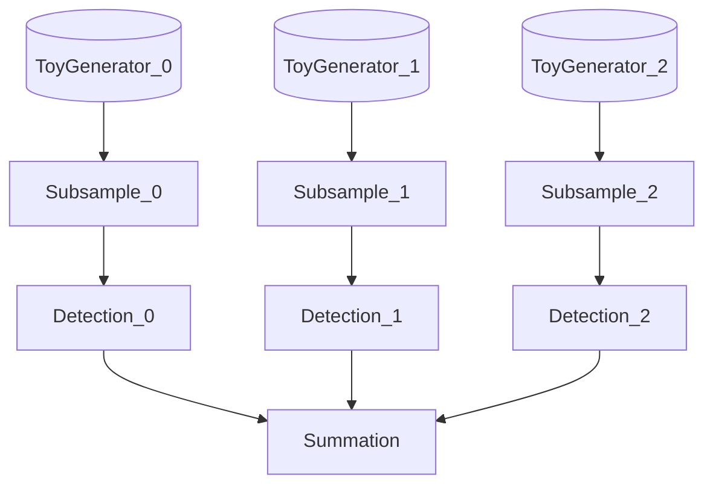

# Piper: Execute

A DAG file can be executed with a specific backend. The backend can be specified using the **-b** option (**-help** to list avaiable backends). 

To execute the demo graph execute (note that the output will be written to the **output** subfolder , excluded from git, pay attention to not produce in any other folder):

```
pipelime piper execute -i dag.yml -p params.yml
```

The demo graph should execute this kind of dag:




As described in **dag.yml** file. The Dag shows the execution of mixed underfolder baked
nodes and user nodes (as **fake_detector.py**). Each node has to be a **PiperCommand** in 
order to be executed in a Piper Dag.

The dag also has the capability to validate intermediate results. This is done by using *inputs_schema*/*outputs_schema* in nodes. See the *outputs_schema* in the *detection* node 
in **dag.yml** file. 


## Monitoring Execution [EXPERIMENTAL]

Befour launching the execution, you can monitor the execution using the **watcher_demo.py** script. The watcher demo accept a "TOKEN" as argument. The token is used to identify the execution, each nodes should share the same token. In a terminal launch:

```
python watcher_demo.py --token token_eyecan
```

Then relaunch the DAG with the same token:

```
pipelime piper execute -i dag.yml -p params.yml -t token_eyecan
```

The Token **token_eyecan** can be any string you want.

### Choosing the channel implementation 
You can specify the type of backend to use (Choixe BulletinBoard by default) by setting the environment variable:

```bash
export PIPELIME_PIPER_CHANNEL_TYPE=$CH_TYPE
```

Where `$CH_TYPE` can be one of `"BULLETIN"` or `"REDIS"`.
